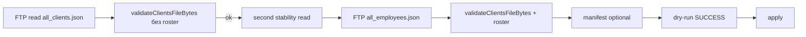

# Диагностика отказа regular-update 08.10.2026 (production ЛК)

**Статус:** read-only код + **Computer (prod БД + Timeweb console validation)**.  
**Production import / dry-run / apply / jobs на агенте не выполнялись.**  
**SHA файла отказа 13:41 не сохранён** — тождество с текущим FTP-снимком **не доказано**.

**Бизнес-модель (утверждено, отдельно от блокера):** [holding-business-model-and-1c-mapping.md](./holding-business-model-and-1c-mapping.md) — типы «моно / моно сеть / групп / групп сеть», правила классификации (draft), варианты A/B, синтетические примеры контракта.

---

## 1. Наблюдение оператора (08.10.2026)

| Факт | Значение |
|------|----------|
| UI (авторизованный prod) | «Отклонено проверками. Client file validation failed on first read. Прежние данные клиентов и назначений сохранены без изменений.» |
| Последнее **успешное** обновление на экране | 08.10.2026, 10:58 (МСК) |
| Карточки (выборочно) | не отображались блоки контрагента и договора |

---

## 2. Read-only свидетельства Computer (production БД, 08.10.2026)

Источник: оператор на Computer, SQL read-only. PII в отчёт не включались.

### 2.1 Неуспешная задача regular-update

| Поле | Значение |
|------|----------|
| Job id | `dea4c6fd-9140-4457-8904-b519cb038040` |
| Завершение | **08.10.2026 13:41:55.926 МСК** |
| `result.status` | `REJECTED_BY_CHECKS` |
| `result.errorCode` | `VALIDATION_FAILED` |
| `clientsReadCount` | **1** |
| `rosterReadCount` | **0** |
| `clientsSourceSha256` | **null** |
| Сообщение | содержит **«Client file validation failed on first read.»** |

**Вывод (подтверждено):** отказ на **первом** чтении/валидации `all_clients.json`, **до** чтения roster и **до apply**. Состояние БД от этой попытки не менялось (apply не выполнялся). Отказ произошёл **до публикации G3** в prod — связь с G3 **не установлена**.

SHA256 файла, отклонённого в 13:41, **не сохранён** в job (`clientsSourceSha256 = null`). Любой **новый** файл с FTP после инцидента **нельзя** считать тем же байтовым снимком, что читала попытка 13:41, без отдельного доказательства (например, совпадения SHA, если бы он был записан).

### 2.2 Последний успешный apply

| Поле | Значение |
|------|----------|
| Завершение | **08.10.2026 10:58:29.985 МСК** |
| SHA успешного файла клиентов | `69b7d70d9553c0f46f2ba55b8644fbc16980a1c2d01b643d6f7272682e46b1cd` |

Этот apply **не** содержал блоков F2–F5 в snapshot (см. п.2.3): успешный прогон 10:58 отражает **legacy/extended без commercial blocks**, а не «частично применённые F2–F5».

### 2.3 Агрегаты `extended_snapshot` (F2–F5)

| Метрика | Значение |
|---------|----------|
| `onec_clients` | **3088** записей |
| `wholesaleExchange` | **0** (ключ отсутствует во всех snapshot) |
| `counterparty` | **0** |
| `clientContract` | **0** |
| `clientCode` | **0** |

**Подтверждено:** отсутствие F2–F5 в production snapshot **не** вызвано отказом 13:41 (apply не было). Карточки без контрагента/договора **согласуются** с пустым snapshot; альтернатива «snapshot заполнен, UI скрывает» **опровергнута** этими агрегатами.

**Файл на FTP (другой SHA, см. §2.6):** ключи F2–F5 **есть** во всех записях файла; в БД блоки **не применены** (нет успешного apply после появления данных в источнике + отказы validation).

### 2.4 Прочее

| Метрика | Значение |
|---------|----------|
| `onec_import_jobs` (regular_update) | всего **6**, active **0** |
| `onec_client_import_runs` | **4** |

### 2.5 Доступ к FTP (атрибуция Computer)

| Канал | Результат |
|-------|-----------|
| Прямой FTP с **Computer** (ранее) | **server FIN** — локальная копия не получена |
| **Timeweb** console, приложение `tandoor-rf` (258307, commit `53712c1`) | **Успешное** чтение `/LC/clients/all_clients.json` (см. §2.6) |

### 2.6 Read-only validation из Timeweb (08.10.2026 **22:35:29.974 МСK**)

Отдельный Node.js-процесс в среде приложения: FTP read → `validateClientsFileBytes` из `dist/onec-clients/validate.js`. **Без** jobs, dry-run, apply, записей в БД, файлов на диск, миграций и deploy. Два чтения байтов **идентичны**; третье структурное чтение — **тот же SHA**.

| Метрика | Значение |
|---------|----------|
| SHA256 | `a957ab335277347a9d370e08a8d802b2850af1b0f549b19a943de723017bce46` |
| Размер | 21 791 152 байт |
| Записей клиентов | **2742** |
| Строк вложенных ТТ | **2145** (не число уникальных `guid_store`) |
| `validation.ok` | **false** |
| `issueCount` | **1056** |
| `issueCodes` (полный набор) | `HOLDING_CYCLE`, `HOLDING_SELF_REFERENCE`, `HOLDING_TARGET_NOT_HOLDING_CARD` |

**Holding (обезличенно):** **422** записи с `guid_holding == guid_client` (сравнение GUID **без учёта регистра**); у всех **422** поле `holding` **отсутствует**. Примеры индексов (0-based): самоссылка на `0,1,2,3`; `HOLDING_CYCLE` на `14,25,72,73,96,120,123,126` (в т.ч. ссылки на индексы вроде `14→2355`, `25→2660` — родители без `holding`). `HOLDING_CYCLE` на потомке самоссылочного корня **не обязательно** означает отдельное кольцо из нескольких holding-карт; **1056 issues ≠ 1056 клиентов**.

**F2–F5 в этом файле (2742 записи):** все **9** ключей **присутствуют** в каждой записи; нестандартных типов (не string/null) **нет**. Непустые строки: `Оптовик_Топ150`=2742; `Оптовик_КатегорияТорговойТочкиТандор`=2625; `Контрагент`=2742; `НаименованиеПолное`=2742; `ЮрФизЛицо`=2742; `Оптовик_ОГРН`=2140; `Оптовик_ОсновнойДоговор`=2453; `Оптовик_ОсновноеСоглашение`=2501; `Код`=2742. Гипотеза **числового `Код`** для текущего снимка **не подтверждена**. Блокировка first-read — **связи холдингов**, не F2–F5 scalar types.

**Ограничения интерпретации:**

| SHA | Смысл |
|-----|--------|
| `a957ab33…` | Проверенный **текущий** FTP-снимок (22:35 MSK) |
| `69b7d70d…` | Утренний **успешный** apply 10:58 — **другой** файл |
| *(13:41)* | **Не сохранён** — **неизвестно**, совпадал ли с `a957ab33…` |
| `b439063…` (historical fixture) | Проходит **текущую** first-read validation, **3087** записей; **не** использовать для отката данных и **не** считать актуальной выгрузкой |

**2742 (файл) vs 3088 (БД):** требует будущей GUID-сверки и учёта shrink guards; **не доказывает** массовое удаление клиентов из БД.

### 2.7 Таксономия holding-issues (Timeweb 22:35, `detectHoldingCycles` / `validateHoldingTargets`)

В снимке SHA `a957ab33…` **других** blocking-кодов first-read validation **нет** — только три кода ниже. Одна запись может дать **несколько** issues (поэтому 1056 issues при 2742 записях).

| Код | Условие в валидаторе | Типичный паттерн в текущем файле (Computer) | Политика `tolerant` |
|-----|----------------------|---------------------------------------------|------------------------|
| `HOLDING_SELF_REFERENCE` | `guid_holding === guid_client` | **422** записей: самоссылка, `holding` **отсутствует** / null; примеры индексов `0→0`, `1→1`, `2→2`, `3→3` | **Всегда** ошибка (не warning) |
| `HOLDING_TARGET_NOT_HOLDING_CARD` | `guid_holding` указывает на существующую карточку с `holding !== true` | Потомки и ссылки на «корни» без `holding=true`; часть цепочек `14→2355`, `25→2660` | **Всегда** ошибка |
| `HOLDING_CYCLE` | При обходе цепочки `guid_holding` повторно встречается GUID | Часто **потомок** самоссылочного корня (повтор родителя в walk), не обязательно отдельное кольцо A→B→C→A; индексы с `CYCLE`: `14,25,72,73,96,120,123,126` | **Всегда** ошибка |

**Кластер 422 (self-reference):** не входит в принятый контракт как «корень 1С» (§4). Показанные примеры: `holding=null`, `guid_holding` равен собственному `guid_client`.

**Сопоставление с job 13:41 MSK** (`dea4c6fd…`):

| | Job 13:41 (prod БД) | Timeweb 22:35 (текущий FTP) |
|--|---------------------|-----------------------------|
| Стадия | First-read `VALIDATION_FAILED` | First-read `validateClientsFileBytes` (эквивалент) |
| `clientsSourceSha256` | **null** | **`a957ab33…`** (из прогона) |
| Вероятная семья причин | Holding validation (сообщение совпадает) | **Подтверждено:** только holding-коды |
| F2–F5 в источнике | **Неизвестно** (SHA не сохранён) | **Присутствуют**, типы OK |
| F2–F5 в `extended_snapshot` | **0 / 3088** (без изменений от этого job) | N/A (apply не выполнялся) |
| Тождество файлов | **Неизвестно** | — |

---

## 3. Подтверждённый путь ошибки в коде (не причина поля)

Цепочка regular-update (кнопка «Обновить из 1С» → worker `regular_update_bundle`):



**Текст «Client file validation failed on first read.»** — только `readStableClientsFile` → `validateClientsFileBytes(firstRead.bytes)` **без** roster:

```47:54:src/onec-clients/read-stable.ts
  const firstValidated = validateClientsFileBytes(firstRead.bytes);
  if (!firstValidated.ok) {
    return {
      ok: false,
      code: "VALIDATION_FAILED",
      message: "Client file validation failed on first read.",
      readCount,
    };
  }
```

Согласовано с Computer: `clientsReadCount=1`, `rosterReadCount=0`, `clientsSourceSha256=null`.

### Пробел observability (подтверждён)

`ValidationIssue` (`code`, `field`, `index`, `outletIndex`) **не** попадают в `onec_import_jobs.result` — только generic `message`.

---

## 4. Согласованный контракт: `guid_holding = guid_client` без `holding=true`

**Вопрос:** является ли самоссылка при отсутствии `holding` штатным обозначением «корня 1С»?

**Связь с бизнес-моделью:** утверждённый факт «у каждого клиента есть холдинг (в т.ч. 1 юрлицо + 1 ТТ)» описывает **тип состава** и целевую модель, но **не** является автоматическим подтверждением, что 422 self-ref в SHA `a957ab33…` — корректный корень. См. §4–5 в [holding-business-model-and-1c-mapping.md](./holding-business-model-and-1c-mapping.md).

**Свидетельства в репозитории (точные формулировки):**

| Источник | Цитата / факт |
|----------|----------------|
| `docs/delivery/clients-field-contract.md` §3.2 (live 03.10.2026) | «`HOLDING_GUID_REJECTED`, **циклы, самоссылки**, `HOLDING_TARGET_NOT_HOLDING_CARD` — **всегда** ошибки» при `tolerant` |
| `docs/delivery/import-runbook.md` | «циклы, **самоссылки** … — apply блокируется» |
| Live audit 03.10.2026 (тот же §3.2) | **471** unknown parent; **1** `HOLDING_TARGET_NOT_HOLDING_CARD` — **не** описание 422 self-roots |
| Код `detectHoldingCycles` | `guid_holding === guid_client` → **`HOLDING_SELF_REFERENCE`** (блокирующая ошибка) |

**Вывод для диагностики 08.10.2026:** в принятом контракте ЛК самоссылка **не** документирована как согласованное обозначение корня; наоборот, она **всегда** отклоняется. Паттерн **422** записей в SHA `a957ab33…` **несовместим** с текущим validator **без** отдельного письменного изменения контракта (см. [fix-plan](./onec-exchange-validation-fix-plan-holding-links.md)).

**Синтетическая проверка валидатора:** `test/unit/onec-holding-link-validation-diagnosis.test.ts` (самоссылка, потомок, кольцо, корректный `holding=true` root).

---

## 5. Read-only SQL (Computer)

### 5.1 Последняя неуспешная задача regular-update

```sql
SELECT
  id,
  status,
  requested_at AT TIME ZONE 'UTC' AS requested_utc,
  started_at AT TIME ZONE 'UTC' AS started_utc,
  finished_at AT TIME ZONE 'UTC' AS finished_utc,
  error_code,
  result->>'status' AS result_status,
  result->>'errorCode' AS result_error_code,
  result->>'message' AS result_message,
  result->>'stage' AS result_stage,
  result->>'clientsReadCount' AS clients_read_count,
  result->>'rosterReadCount' AS roster_read_count,
  result->>'clientsSourceSha256' AS clients_sha256,
  result->>'employeeRosterSourceSha256' AS roster_sha256
FROM onec_import_jobs
WHERE kind = 'regular_update_bundle'
ORDER BY requested_at DESC
LIMIT 5;
```

### 5.2 Последний успешный apply (сверка с 10:58 МСК)

```sql
SELECT
  id,
  finished_at AT TIME ZONE 'Europe/Moscow' AS finished_msk,
  status,
  mode,
  source_record_count
FROM onec_client_import_runs
WHERE mode = 'apply' AND status = 'success'
ORDER BY finished_at DESC
LIMIT 3;
```

*(Колонка `record_count` отсутствует — PostgreSQL 42703.)*

### 5.3 Агрегаты F2–F5 в snapshot (read-only, без PII)

```sql
SELECT
  COUNT(*)::int AS clients_total,
  COUNT(*) FILTER (WHERE extended_snapshot ? 'wholesaleExchange')::int AS has_wholesale_exchange,
  COUNT(*) FILTER (WHERE extended_snapshot ? 'counterparty')::int AS has_counterparty,
  COUNT(*) FILTER (WHERE extended_snapshot ? 'clientContract')::int AS has_client_contract,
  COUNT(*) FILTER (WHERE extended_snapshot ? 'clientCode')::int AS has_client_code
FROM onec_clients;
```

### 5.4 Локальная валидация **локальной копии** файла (без БД / без сети)

```bash
export AUDIT_CLIENTS_PATH=/path/to/all_clients.json
node --import tsx scripts/diagnose-clients-file-validation.ts > /tmp/clients-validation.json
```

Вывод: `sha256`, `issueCodes`, `sampleIssues` с `{ code, field, index, outletIndex? }` — **без** значений полей, ФИО, телефонов, email и содержимого записей.

**Порядок диагностики (обязательный):**

1. Стабильная **локальная копия** свежего файла (после успешного FTP, не FIN).
2. `diagnose-clients-file-validation.ts` — чистая validation без БД.
3. Точный JSON-путь (`field`) + `index` / `outletIndex` + фактический тип (отдельно, без публикации PII).
4. Сверка с **согласованным** контрактом F1–F5/G (код + docs), не с synthetic fixtures как с prod-истиной.
5. **Отдельное** предложение минимального исправления (данные / ops / observability) — только после п.1–4.

---

## 6. Синтетический пример отказа first-read (**не** prod-причина)

Локальный extended_v1 fixture в unit-тесте: **`Код`** как **number** → `INVALID_CLIENT_CODE_EXCHANGE_FIELD`.  
Это демонстрация класса «неверный тип scalar F-field» и generic message в `readStableClientsFile`. **Не** вывод о том, что production-отказ 13:41 вызван полем `Код`.

Тесты: `test/unit/onec-exchange-validation-first-read-diagnosis.test.ts`, `test/unit/diagnose-clients-file-validation.test.ts`.

---

## 7. Связь отказы validation ↔ F2–F5 в UI

| Утверждение | Статус |
|-------------|--------|
| Отказ 13:41 **не применил** bundle | **Подтверждено** (first-read, apply не дошёл) |
| Отказ **обнулил** F2–F5 | **Нет** |
| F2–F5 **отсутствуют** во всех 3088 snapshot | **Подтверждено** (Computer) |
| Пустые блоки в UI **из-за** пустого snapshot | **Согласуется** с п.2.3; не единственная возможная причина до проверки DTO, но SQL опровергает «snapshot полон» |
| Отказ 13:41 **вызван** отсутствием F2–F5 в БД | **Нет** — validation падает на **входящем** JSON, не на snapshot |
| F2–F5 **в текущем FTP-файле** (`a957ab33…`) | **Подтверждено** (Timeweb 22:35) — ключи и типы OK |
| Причина validation failure **текущего** файла | **Подтверждено:** holding links (§2.6), не F2–F5 types |
| Тождество файла 13:41 и `a957ab33…` | **Неизвестно** (SHA 13:41 не сохранён) |
| Numeric `Код` как причина | **Опровергнуто** для `a957ab33…` |

---

## 8. План действий (pipeline **не менялся** в PR #71)

Детальный черновик: [onec-exchange-validation-fix-plan-holding-links.md](./onec-exchange-validation-fix-plan-holding-links.md).

1. Согласовать с владельцем данных: самоссылка без `holding=true` — ошибка 1С или новый контракт (§4).
2. По умолчанию — **исправление источника** (нормализация 422 корней / колец), затем повтор read-only validation.
3. **Parser** — только при **доказанном** контракте; без авто-`holding=true` и без отключения cycle/self-ref checks.
4. После green validation + bundle roster — apply/backfill F6 по runbook (отдельное окно).
5. GUID-сверка 2742 vs 3088 и shrink guards — отдельный шаг.
6. Observability issue codes в job result — параллельно, низкий риск.

---

## 9. Ограничения Cloud Agent

| Ресурс | Доступ |
|--------|--------|
| Production `DATABASE_URL` | нет |
| FTP | только через факты Computer / Timeweb console |
| Production dry-run / import | не выполнялись |

---

## 10. Тесты

```bash
npm run typecheck
node --import tsx --test test/unit/onec-exchange-validation-first-read-diagnosis.test.ts
node --import tsx --test test/unit/diagnose-clients-file-validation.test.ts
node --import tsx --test test/unit/onec-holding-link-validation-diagnosis.test.ts
```

F6 и серия F **не** закрыты этим документом.
