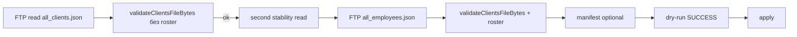

# Диагностика отказа regular-update 08.10.2026 (production ЛК)

**Статус:** read-only анализ кода + **read-only результаты Computer (production БД)**.  
**Production import / dry-run / apply на агенте не выполнялись.**  
**Конкретное ошибочное поле и SHA отклонённого файла — не установлены.**

---

## 1. Наблюдение оператора (08.10.2026)

| Факт | Значение |
|------|----------|
| UI (авторизованный prod) | «Отклонено проверками. Client file validation failed on first read. Прежние данные клиентов и назначений сохранены без изменений.» |
| Последнее **успешное** обновление на экране | 08.10.2026, 10:58 (МСК) |
| Карточки (выборочно) | не отображались блоки контрагента и договора |

---

## 2. Read-only свидетельства Computer (production БД, 08.10.2026)

Источник: оператор на Computer, SQL read-only. PII в отчёт не включались.

### 2.1 Неуспешная задача regular-update

| Поле | Значение |
|------|----------|
| Job id | `dea4c6fd-9140-4457-8904-b519cb038040` |
| Завершение | **08.10.2026 13:41:55.926 МСК** |
| `result.status` | `REJECTED_BY_CHECKS` |
| `result.errorCode` | `VALIDATION_FAILED` |
| `clientsReadCount` | **1** |
| `rosterReadCount` | **0** |
| `clientsSourceSha256` | **null** |
| Сообщение | содержит **«Client file validation failed on first read.»** |

**Вывод (подтверждено):** отказ на **первом** чтении/валидации `all_clients.json`, **до** чтения roster и **до apply**. Состояние БД от этой попытки не менялось (apply не выполнялся). Отказ произошёл **до публикации G3** в prod — связь с G3 **не установлена**.

SHA256 файла, отклонённого в 13:41, **не сохранён** в job (`clientsSourceSha256 = null`). Любой **новый** файл с FTP после инцидента **нельзя** считать тем же байтовым снимком, что читала попытка 13:41, без отдельного доказательства (например, совпадения SHA, если бы он был записан).

### 2.2 Последний успешный apply

| Поле | Значение |
|------|----------|
| Завершение | **08.10.2026 10:58:29.985 МСК** |
| SHA успешного файла клиентов | `69b7d70d9553c0f46f2ba55b8644fbc16980a1c2d01b643d6f7272682e46b1cd` |

Этот apply **не** содержал блоков F2–F5 в snapshot (см. п.2.3): успешный прогон 10:58 отражает **legacy/extended без commercial blocks**, а не «частично применённые F2–F5».

### 2.3 Агрегаты `extended_snapshot` (F2–F5)

| Метрика | Значение |
|---------|----------|
| `onec_clients` | **3088** записей |
| `wholesaleExchange` | **0** (ключ отсутствует во всех snapshot) |
| `counterparty` | **0** |
| `clientContract` | **0** |
| `clientCode` | **0** |

**Подтверждено:** отсутствие F2–F5 в production snapshot **не** вызвано отказом 13:41 (apply не было). Карточки без контрагента/договора **согласуются** с пустым snapshot; альтернатива «snapshot заполнен, UI скрывает» **опровергнута** этими агрегатами.

**Не установлено:** передаёт ли **текущий** FTP-файл ключи F2–F5 (файл не получен, см. п.2.4).

### 2.4 Прочее

| Метрика | Значение |
|---------|----------|
| `onec_import_jobs` (regular_update) | всего **6**, active **0** |
| `onec_client_import_runs` | **4** |

### 2.5 Блокер: свежий FTP-файл

Computer **не смог** скачать актуальный `all_clients.json`: соединение завершилось **server FIN**.  
→ Конкретный JSON-путь, тип значения и SHA **отклонённого** файла остаются **неизвестными**.

**Исторический** audit `b439063…` (`test/fixtures/onec-clients/recovered-exchange-structure.json`) — **не** актуальная выгрузка и **не** файл попытки 13:41.

---

## 3. Подтверждённый путь ошибки в коде (не причина поля)

Цепочка regular-update (кнопка «Обновить из 1С» → worker `regular_update_bundle`):



**Текст «Client file validation failed on first read.»** — только `readStableClientsFile` → `validateClientsFileBytes(firstRead.bytes)` **без** roster:

```47:54:src/onec-clients/read-stable.ts
  const firstValidated = validateClientsFileBytes(firstRead.bytes);
  if (!firstValidated.ok) {
    return {
      ok: false,
      code: "VALIDATION_FAILED",
      message: "Client file validation failed on first read.",
      readCount,
    };
  }
```

Согласовано с Computer: `clientsReadCount=1`, `rosterReadCount=0`, `clientsSourceSha256=null`.

### Пробел observability (подтверждён)

`ValidationIssue` (`code`, `field`, `index`, `outletIndex`) **не** попадают в `onec_import_jobs.result` — только generic `message`.

---

## 4. Read-only SQL (Computer)

### 4.1 Последняя неуспешная задача regular-update

```sql
SELECT
  id,
  status,
  requested_at AT TIME ZONE 'UTC' AS requested_utc,
  started_at AT TIME ZONE 'UTC' AS started_utc,
  finished_at AT TIME ZONE 'UTC' AS finished_utc,
  error_code,
  result->>'status' AS result_status,
  result->>'errorCode' AS result_error_code,
  result->>'message' AS result_message,
  result->>'stage' AS result_stage,
  result->>'clientsReadCount' AS clients_read_count,
  result->>'rosterReadCount' AS roster_read_count,
  result->>'clientsSourceSha256' AS clients_sha256,
  result->>'employeeRosterSourceSha256' AS roster_sha256
FROM onec_import_jobs
WHERE kind = 'regular_update_bundle'
ORDER BY requested_at DESC
LIMIT 5;
```

### 4.2 Последний успешный apply (сверка с 10:58 МСК)

```sql
SELECT
  id,
  finished_at AT TIME ZONE 'Europe/Moscow' AS finished_msk,
  status,
  mode,
  source_record_count
FROM onec_client_import_runs
WHERE mode = 'apply' AND status = 'success'
ORDER BY finished_at DESC
LIMIT 3;
```

*(Колонка `record_count` отсутствует — PostgreSQL 42703.)*

### 4.3 Агрегаты F2–F5 в snapshot (read-only, без PII)

```sql
SELECT
  COUNT(*)::int AS clients_total,
  COUNT(*) FILTER (WHERE extended_snapshot ? 'wholesaleExchange')::int AS has_wholesale_exchange,
  COUNT(*) FILTER (WHERE extended_snapshot ? 'counterparty')::int AS has_counterparty,
  COUNT(*) FILTER (WHERE extended_snapshot ? 'clientContract')::int AS has_client_contract,
  COUNT(*) FILTER (WHERE extended_snapshot ? 'clientCode')::int AS has_client_code
FROM onec_clients;
```

### 4.4 Локальная валидация **локальной копии** файла (без БД / без сети)

```bash
export AUDIT_CLIENTS_PATH=/path/to/all_clients.json
node --import tsx scripts/diagnose-clients-file-validation.ts > /tmp/clients-validation.json
```

Вывод: `sha256`, `issueCodes`, `sampleIssues` с `{ code, field, index, outletIndex? }` — **без** значений полей, ФИО, телефонов, email и содержимого записей.

**Порядок диагностики (обязательный):**

1. Стабильная **локальная копия** свежего файла (после успешного FTP, не FIN).
2. `diagnose-clients-file-validation.ts` — чистая validation без БД.
3. Точный JSON-путь (`field`) + `index` / `outletIndex` + фактический тип (отдельно, без публикации PII).
4. Сверка с **согласованным** контрактом F1–F5/G (код + docs), не с synthetic fixtures как с prod-истиной.
5. **Отдельное** предложение минимального исправления (данные / ops / observability) — только после п.1–4.

---

## 5. Синтетический пример отказа first-read (**не** prod-причина)

Локальный extended_v1 fixture в unit-тесте: **`Код`** как **number** → `INVALID_CLIENT_CODE_EXCHANGE_FIELD`.  
Это демонстрация класса «неверный тип scalar F-field» и generic message в `readStableClientsFile`. **Не** вывод о том, что production-отказ 13:41 вызван полем `Код`.

Тесты: `test/unit/onec-exchange-validation-first-read-diagnosis.test.ts`, `test/unit/diagnose-clients-file-validation.test.ts`.

---

## 6. Связь отказ 13:41 ↔ F2–F5 в UI

| Утверждение | Статус |
|-------------|--------|
| Отказ 13:41 **не применил** bundle | **Подтверждено** (first-read, apply не дошёл) |
| Отказ **обнулил** F2–F5 | **Нет** |
| F2–F5 **отсутствуют** во всех 3088 snapshot | **Подтверждено** (Computer) |
| Пустые блоки в UI **из-за** пустого snapshot | **Согласуется** с п.2.3; не единственная возможная причина до проверки DTO, но SQL опровергает «snapshot полон» |
| Отказ 13:41 **вызван** отсутствием F2–F5 в БД | **Нет** — validation падает на **входящем** JSON, не на snapshot |
| Наличие F2–F5 **в текущем FTP-файле** | **Не установлено** (FTP FIN) |
| Причина validation failure | **Не установлена** (нет файла / нет issue details в job) |

---

## 7. План действий (pipeline **не менялся** в PR #71)

1. **Разблокировать FTP:** повтор read-only скачивания `all_clients.json` (+ при необходимости `all_employees.json`) с Computer; устранить FIN на стороне сети/FTP.
2. **Локальная копия →** `diagnose-clients-file-validation.ts` (п.4.4).
3. По `sampleIssues` — минимальное исправление **только с доказательствами** (данные 1С vs контракт vs bug parser).
4. **Не** ослаблять validation/shrink guards и **не** менять выгрузку 1С «наугад» (в т.ч. по синтетическому примеру с numeric `Код`).
5. **Данные ЛК:** после успешного apply по runbook F6 — backfill F2–F5; отказ 13:41 backfill **не заменяет**.
6. **Будущий PR (observability):** сохранять в job result без PII: `issueCodes`, sample `{ code, field, index, outletIndex }`, SHA256 bytes до validate при first-read fail.

---

## 8. Ограничения Cloud Agent

| Ресурс | Доступ |
|--------|--------|
| Production `DATABASE_URL` | нет |
| Свежий FTP / `/LC/...` | нет (блокер) |
| Production dry-run / import | не выполнялись |

---

## 9. Тесты

```bash
npm run typecheck
node --import tsx --test test/unit/onec-exchange-validation-first-read-diagnosis.test.ts
node --import tsx --test test/unit/diagnose-clients-file-validation.test.ts
```

F6 и серия F **не** закрыты этим документом.
