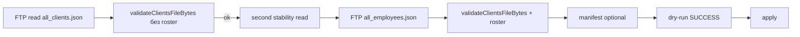

# Диагностика отказа regular-update 08.10.2026 (production ЛК)

**Статус:** read-only анализ кода и локальных инструментов на ветке диагностики.  
**Production import / dry-run / apply не выполнялись.**  
**Связь «отказ обновления ↔ пустые блоки F2–F5 в карточках» не доказана.**

---

## 1. Наблюдение оператора (08.10.2026)

| Факт | Значение |
|------|----------|
| UI (авторизованный prod) | «Отклонено проверками. Client file validation failed on first read. Прежние данные клиентов и назначений сохранены без изменений.» |
| Последнее **успешное** обновление на экране | 08.10.2026, 10:58 (МСК) |
| Карточки (выборочно) | не отображались блоки контрагента и договора |

---

## 2. Подтверждённый путь ошибки в коде (не причина поля)

Цепочка regular-update (кнопка «Обновить из 1С» → worker `regular_update_bundle`):



**Текст «Client file validation failed on first read.»** задаётся только в `readStableClientsFile` при `validateClientsFileBytes(firstRead.bytes)` **без** `employeeRoster` — до чтения roster и до apply:

```47:54:src/onec-clients/read-stable.ts
  const firstValidated = validateClientsFileBytes(firstRead.bytes);
  if (!firstValidated.ok) {
    return {
      ok: false,
      code: "VALIDATION_FAILED",
      message: "Client file validation failed on first read.",
      readCount,
    };
  }
```

Worker оборачивает dry-run в `executeRegularUpdateBundleJob`: при `REJECTED_BY_CHECKS` к сообщению добавляется суффикс о сохранении данных (`DATA_PRESERVED_SUFFIX` в `regular-update-job.ts`). Apply **не вызывается**.

| Этап | Подтверждение для данного UI-текста |
|------|-------------------------------------|
| FTP read | Предполагается успешен (иначе было бы `FTP_ERROR` / `TIMEOUT` и другой catalog message) |
| JSON parse | Внутри `validateClientsFileBytes` |
| **First-read validation** | **Да — точное совпадение message** |
| Roster + bundle validation | **Нет** (другие сообщения: «Bundle validation failed after stable reads.» и т.д.) |
| Apply / snapshot write | **Нет** |

**errorCode** в `RegularUpdateResult`: `VALIDATION_FAILED`.  
**stage** после normalize: `bundle_validation` (маппинг в `job-failure.ts`; семантически для first-read точнее «clients file validation», но в UI метка «Проверка комплекта»).

### Пробел observability (подтверждён)

Детали `ValidationIssue` (код, `field`, `index`) **не попадают** в `onec_import_jobs.result` — только generic `message`. Оператор видит текст выше **без** JSON-пути и без `issueCodes`.

---

## 3. Что **не** установлено без read-only данных Computer / prod БД

| Вопрос | Блокер |
|--------|--------|
| Конкретное поле / клиент / JSON-путь | Нет доступа к актуальному `all_clients.json` и к `result` последней failed job на агенте |
| SHA256 неуспешной попытки | В first-read failure `clientsSourceSha256` часто **отсутствует** (SHA не пишется в result при этом отказе) |
| Время failed job UTC | Нужна строка из `onec_import_jobs` |

**Исторический audit** `b439063…` (`test/fixtures/onec-clients/recovered-exchange-structure.json`) — **не** актуальный FTP-файл; для причин отказа 08.10 не использовался.

---

## 4. Минимальные read-only запросы для Computer

### 4.1 Последняя неуспешная задача regular-update

```sql
SELECT
  id,
  status,
  requested_at AT TIME ZONE 'UTC' AS requested_utc,
  started_at AT TIME ZONE 'UTC' AS started_utc,
  finished_at AT TIME ZONE 'UTC' AS finished_utc,
  error_code,
  result->>'status' AS result_status,
  result->>'errorCode' AS result_error_code,
  result->>'message' AS result_message,
  result->>'stage' AS result_stage,
  result->>'clientsReadCount' AS clients_read_count,
  result->>'rosterReadCount' AS roster_read_count,
  result->>'clientsSourceSha256' AS clients_sha256,
  result->>'employeeRosterSourceSha256' AS roster_sha256
FROM onec_import_jobs
WHERE kind = 'regular_update_bundle'
ORDER BY requested_at DESC
LIMIT 5;
```

Ожидание при совпадении с UI: `result_error_code = 'VALIDATION_FAILED'`, `result_message` содержит `Client file validation failed on first read`, `clients_read_count = 1`, `roster_read_count = 0` или NULL.

### 4.2 Последний успешный apply (сверка с 10:58 МСК)

```sql
SELECT
  id,
  finished_at AT TIME ZONE 'Europe/Moscow' AS finished_msk,
  status,
  mode,
  record_count
FROM onec_client_import_runs
WHERE mode = 'apply' AND status = 'success'
ORDER BY finished_at DESC
LIMIT 3;
```

### 4.3 Агрегаты F2–F5 в snapshot (read-only, без PII)

```sql
SELECT
  COUNT(*)::int AS clients_total,
  COUNT(*) FILTER (WHERE extended_snapshot ? 'wholesaleExchange')::int AS has_wholesale_exchange,
  COUNT(*) FILTER (WHERE extended_snapshot ? 'counterparty')::int AS has_counterparty,
  COUNT(*) FILTER (WHERE extended_snapshot ? 'clientContract')::int AS has_client_contract,
  COUNT(*) FILTER (WHERE extended_snapshot ? 'clientCode')::int AS has_client_code,
  COUNT(*) FILTER (
    WHERE jsonb_typeof(extended_snapshot->'counterparty'->'counterparty') = 'string'
      AND (extended_snapshot->'counterparty'->>'counterparty') <> ''
  )::int AS counterparty_nonempty
FROM onec_clients;
```

Интерпретация **только со свидетельствами**:

| Паттерн | Возможная гипотеза (не вывод) |
|---------|-------------------------------|
| Блоки отсутствуют у большинства, успешный apply был до merge F3/F4 | Данные **не применялись** после появления полей в pipeline — нужен backfill (отдельный процесс F6) |
| Блоки есть в snapshot, UI пусто | Цепочка **DTO/UI**, не FTP |
| Failed job 08.10 + last success 10:58 | Отказ **после** последнего успеха; этот отказ **не мог** записать F2–F5; карточки отражают состояние на 10:58 |

### 4.4 Локальная валидация скачанного файла (без БД)

```bash
# после скачивания all_clients.json штатным read-only способом (FTP/probe), путь локальный
export AUDIT_CLIENTS_PATH=/path/to/all_clients.json
node --import tsx scripts/diagnose-clients-file-validation.ts > /tmp/clients-validation.json
```

Скрипт выводит: `sha256`, `issueCodes`, `sampleIssues` `{ code, field, index }` **без значений полей**.

Дополнительно (структура ключей):

```bash
npm run audit:exchange-fields
# с тем же AUDIT_CLIENTS_PATH
```

---

## 5. Локально воспроизведённый класс отказа (не утверждение prod-причины)

Локальный extended_v1 fixture (см. тест): поле **`Код`** с типом **number** (`0`) вместо string.

| Проверка | Результат |
|----------|-----------|
| `validateClientsFileBytes` | `INVALID_CLIENT_CODE_EXCHANGE_FIELD`, index `0` |
| `readStableClientsFile` | `VALIDATION_FAILED`, message **first read** (без деталей в message) |

Аналогичные коды при неверном типе: `INVALID_WHOLESALE_EXCHANGE_FIELD`, `INVALID_COUNTERPARTY_EXCHANGE_FIELD`, `INVALID_CLIENT_CONTRACT_EXCHANGE_FIELD`, ошибки outlet/LPR и т.д. (`extended-validate.ts`).

**Regression-тест:** `test/unit/onec-exchange-validation-first-read-diagnosis.test.ts`.

---

## 6. Связь с отсутствием F2–F5 в UI

| Утверждение | Статус |
|-------------|--------|
| Failed run 08.10 **не применил** новый bundle | **Да**, если подтверждён first-read `VALIDATION_FAILED` (apply не дошёл) |
| Этот отказ **обнулил** counterparty/contract в БД | **Нет** (data preserved, apply не выполнялся) |
| Пустые блоки в карточках **из-за** этого отказа | **Не доказано** — могли не быть в snapshot после 10:58 или скрыты DTO/scope |
| Источник не передаёт ключи | Требует `diagnose-clients-file-validation.ts` / audit на **актуальном** файле |
| Snapshot заполнен, UI не показывает | Требует SQL п.4.3 + API/card для тех же `guid_client` |

---

## 7. План исправления (отдельно от этой диагностики; pipeline **не менялся**)

1. **Оперативно (1С / данные):** по `sampleIssues` из п.4.4 исправить тип/формат поля в выгрузке (частый класс — scalar F2–F5 не string).
2. **Ops:** после исправления файла — штатный dry-run/apply по runbook F6, **не** в рамках этой задачи.
3. **Продукт (минимальное улучшение observability, будущий PR):** при `VALIDATION_FAILED` сохранять в `RegularUpdateResult` без PII: `issueCodes[]`, первые N `{ code, field, index }`, `clientsSourceSha256` даже при first-read fail (hash до validate).
4. **Данные ЛК:** если п.4.3 показывает отсутствие блоков при успешном apply 10:58 — плановый **backfill F6**, не повторный blind apply.

---

## 8. Ограничения выполнения на Cloud Agent

| Ресурс | Доступ |
|--------|--------|
| `DATABASE_URL` | test DB only |
| `ONEC_FTP_*` | не заданы |
| `/LC/clients/all_clients.json` на VM | отсутствует |
| Production dry-run / import | **не выполнялись** (запрещено) |

---

## 9. Тесты (локально, test DB не используется)

```bash
node --import tsx --test test/unit/onec-exchange-validation-first-read-diagnosis.test.ts
```

F6 и серия F **не** закрыты этим документом.
