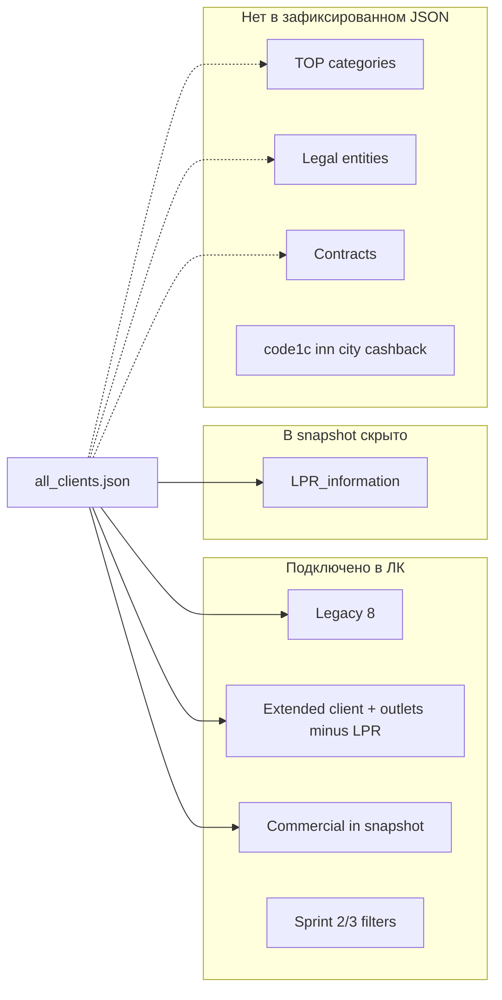

# F0 — карта оставшихся полей обмена 1С → ЛК

**Серия:** F (после G1/G2 на `main`; **не** зависит от G3 / PR #62)  
**Ветка:** `cursor/f0-remaining-exchange-fields-9e11`  
**Base doc SHA:** `965bbed61b12b9e2e92496b64b04f1826f4a34cd` (`main` после merge G1/G2)  
**Объём F0:** исследование + этот документ; **без** production-кода, импорта, миграций и полного test suite.

**Эталон UI (не доказательство JSON):** [прототип «Вся информация о клиенте»](https://www.perplexity.ai/computer/a/tandoor-rf-vizualnyi-prototip-TyhOzG0mT06dPTayt88xTA) — секции «Холдинг / юрлица», «ЛПР», «Расчёты и договор», «Магазин и доставка» задают целевое отображение.

**Целевое правило доступа (F1+):** читатель **доступного** клиента/ТТ видит **все бизнес-поля** этой записи (ЛПР, дата рождения, персональные бонусы, реквизиты). Чужие ТТ, технические секреты и права редактирования не раскрываются.  
**Текущий код:** ЛПР и персональные бонусы ЛПР **намеренно не публикуются** в API (`sensitiveFieldsWithheld: true`) — см. § ЛПР.

---

## 1. Источники и происхождение

### 1.1 Файл в среде F0

| Проверка | Результат |
|----------|-----------|
| `all_clients.json` в репозитории / VM | **нет** |
| `AUDIT_CLIENTS_PATH` | **не задан** |
| `npm run audit:exchange-fields` | fixtures + синтетика `extended_v1` (см. §1.3) |

**Вывод:** отсутствие поля в fixtures/parser **не** доказывает отсутствие в production JSON. Ниже — сверка **код + зафиксированные live-свидетельства + синтетика**.

### 1.2 Зафиксированные снимки `all_clients.json` (read-only, не в repo)

| Снимок | Путь | Дата / контекст | SHA-256 | Записей | Ключи верхнего уровня (наблюдение) |
|--------|------|-----------------|---------|---------|-----------------------------------|
| **Legacy** | `/LC/clients/all_clients.json` | FTP 23.09.2026; сверка 28.09.2026 | `dc0f7f243d083d9fc6aeb14fbed8db42babd2a78e9b57da2ac2f85cd969e0086` | 3 824 | 8 импортируемых + `Discount`, `DiscountAmount`, `Markups` |
| **Extended live** | тот же путь | проверка **03.10.2026** (~20,9 MiB) | `52307bbde0dbb1f076b8eee9dd56c3a4a2134bd19ffb8164e885a2f55d690b10` | 3 087 клиентов, 473 вложенные ТТ | legacy-ключи + `holding`, `retail_outlets[]`, доп. ответственные, вложенные блоки (см. [clients-field-contract.md §3.2](./clients-field-contract.md#32-live-наблюдения-и-поддержанные-адаптации-03102026)) |

Источники метаданных: [r02-existing-evidence.md](./r02-existing-evidence.md), [clients-field-contract.md](./clients-field-contract.md).

**Актуальность после 03.10.2026 в F0 не перепроверялась** — для свежего SHA нужен запрос к Computer (§1.4).

Связанные файлы обмена (вне `all_clients.json`, но для контекста F/G):

| Файл | Назначение | В F0 |
|------|------------|------|
| `/LC/clients/all_employees.json` | roster сотрудников (`guid_team` / `name_team` — **членство в команде**, не лидер группы) | не аудировался локально; G3 отдельно |
| `/LC/catalog/*/data.xml` | каталог | вне scope F0 |

### 1.3 Подтверждение ключей в репозитории (не live)

| Источник | Назначение |
|----------|------------|
| `test/fixtures/onec-clients/valid-two-records.json` | legacy 8 ключей |
| `test/fixtures/onec-clients/extra-unknown-fields.json` | `Discount`, `DiscountAmount`, `Markups[]` |
| `test/helpers/onec-clients-extended-fixtures.ts` | контракт `extended_v1` (полный перечень путей для audit) |
| `test/helpers/onec-clients-live-fixtures.ts` | **форма** live-полей без PII (не выгрузка) |
| `scripts/audit-exchange-fields.ts` | read-only union ключей |

### 1.4 Запрос к Computer (если нужен свежий structural slice)

Один read-only прогон по **последнему** `/LC/clients/all_clients.json`:

1. **Метаданные:** размер, число записей, **SHA-256**, дата чтения (UTC), без содержимого массива.
2. **Union JSON-путей** по всему файлу (как `audit-exchange-fields`, `scanAll=true`), плюс список **top-level ключей**, встречающихся хотя бы в одной записи, но **не** входящих в известный контракт (§2–§8).
3. **Обезличенный structural slice:** 3–5 записей с **разными формами** (legacy-only, extended с `retail_outlets`, с коммерческими полями), значения заменить на `"…"` / `0` / `false`, **сохранить ключи, типы, вложенность и GUID-связи** (можно синтетические UUID).
4. **Агрегаты без PII** для путей из §2–§8: доля записей с ключом; для `LPR_information.*`, `additional_information.*`, коммерческих полей — доля непустых / sentinel (`0001-01-01…`); для неизвестных блоков «юрлиц»/«договоров»/«TOP» — **имена ключей и типы**, если найдены.
5. **Не** передавать: полные ФИО, телефоны, email, ИНН/КПП/счета, даты рождения, полный файл.

Положить артеfact в repo: `test/fixtures/onec-clients/f0-live-structural-slice.json` (или приложение к PR) + обновить §1.2 этой карты.

---

## 2. Легенда статусов (сквозная)

| Статус | Значение |
|--------|----------|
| **нет в источнике** | Ключ **не** наблюдался в зафиксированных live-свидетельствах и **не** в контракте extended fixtures; возможно появится позже — нужен §1.4 |
| **в источнике, часто пусто** | Ключ есть; значимая доля пустых/sentinel (зафиксировано для live где известно) |
| **парсится → хранится** | validate/apply кладёт в `onec_clients` / `extended_snapshot` / registry |
| **хранится, скрыто UI/API** | В snapshot есть, DTO не отдаёт или заглушка |
| **отображается** | Карточка и/или список и/или фильтр (Sprint 2/3) |
| **повторный импорт** | Нужен ли re-import после доработки parser/storage |

**Цепочка:** JSON → `extended-validate.ts` / legacy `validate.ts` → `extended-apply.ts` / legacy upsert → `extended_snapshot` JSONB → `extended-dto.ts` / list DTO → `public/client-card*.js`, `public/clients*.js` → `field-filter-registry.ts`.

**Production apply расширения:** по умолчанию `extendedContractVerification=unverified` — расширенный блок может **не** попадать в рабочий snapshot до подтверждения контракта ([clients-field-contract.md §3](./clients-field-contract.md)). Legacy 8 ключей применяются всегда.

---

## 3. Legacy — восемь ключей (уровень клиента)

| JSON-путь | Тип | Источник | Хранение | DTO / карточка | Колонки | Фильтры | Статус ЛК | Re-import |
|-----------|-----|----------|----------|----------------|---------|---------|-----------|-----------|
| `guid_client` | UUID string | legacy + extended | PK `onec_clients` | id | — | scope | **отображается** | нет |
| `name_client` | string | да | column | name | name | `q` | **отображается** | нет |
| `guid_holding` / `name_holding` | string | да | columns | holding | holding | `holding` | **отображается** | нет |
| `guid_manager` / `name_manager` | UUID + string | да | columns | manager | manager | `clientManager`, `missing*`, `*Mode` | **отображается** | нет |
| `address` | string | да | column | address | address | `q`, filled/empty | **отображается** | нет |
| `telephone[]` | string[] | да | JSONB | phones | phone | `phone`, `q`, filled/empty | **отображается** | нет |

См. [sprint2-field-map.md](./sprint2-field-map.md).

---

## 4. Коммерческие поля (уровень клиента)

| JSON-путь | Тип (наблюдение) | Источник | Parser | Хранение | Карточка | Колонки clients | Фильтры | Статус | Re-import |
|-----------|------------------|----------|--------|----------|----------|-----------------|---------|--------|-----------|
| `Discount` | string | legacy снимок: ключ у всех записей; 244 непустых | `commercial-fields.ts` | `extended_snapshot.commercial.discountProgram` при **extended apply** | read-only label | `discountProgram` | `discountProgram`, filled/empty | **отображается**, если snapshot содержит commercial; legacy-only import — **не сохраняется** | да, если prod без extended snapshot |
| `DiscountAmount` | number | ключ у всех в legacy снимке |同上 | `commercial.discountAmount` | label | `discountAmount` | min/max, filled/empty |同上 |同上 |
| `Markups[]` | `{ Name, Percentage }[]` | 18 непустых массивов в legacy |同上 | `commercial.markups` | список | — | `markupName`, `markupPercentage`, filled/empty | карточка + фильтр; **не** колонка списка |同上 |

Legacy import: warning `EXTRA_FIELDS`, **не** в parsed 8 полей.  
См. [sprint3-field-map.md](./sprint3-field-map.md), [clients-field-contract.md §2](./clients-field-contract.md#2-коммерческие-поля--наблюдение-vs-смысл-vs-импорт).

**Осталось для F6:** согласовать с 1С семантику (Q4–Q6) — не блокирует отображение уже сохранённых значений.

---

## 5. Extended — клиент (вне `retail_outlets`)

| JSON-путь | Тип | Live 03.10 | Parser / storage | Карточка | Список / фильтр | Статус | Re-import |
|-----------|-----|------------|------------------|----------|-----------------|--------|-----------|
| `holding` | boolean | да | snapshot | «Данные» | — | **отображается** | при blocked extended — snapshot может не обновляться |
| `guid_regional_manager` / `name_regional_manager` | UUID + string | да | snapshot | ответственные | regional + 8-filter set | **отображается** | см. extended gate |
| `guid_hardware_manager` / `name_hardware_manager` | UUID + string | да | snapshot | да | hardware + filters | **отображается** |同上 |
| `guid_head_of_the_sales_department` / `name_head_of_the_sales_department` | UUID + string | да | snapshot; **РОП клиента**, не лидер команды 1С | да | rop + filters | **отображается** |同上 |
| `retail_outlets` | array | 473 ТТ | `currentRetailOutlets` + history + `onec_retail_outlets` | вкладка «Данные» | `outletsCount`, entity=outlets | **отображается** (с R13 outlet access) | да для новых полей внутри ТТ |

**Не в `all_clients.json`:** `guid_team` / `name_team` — поля **roster** (`all_employees.json`), Sprint G; в F0 не смешивать с клиентским JSON.

---

## 6. Торговые точки — `retail_outlets[]` (кроме ЛПР)

| JSON-путь | Тип | Live / контракт | Хранение | DTO / UI | Фильтры (clients/outlets) | Статус | Re-import |
|-----------|-----|-----------------|----------|----------|---------------------------|--------|-----------|
| `guid_store` | UUID | 472/473 с GUID (03.10) | snapshot + registry PK | ID ТТ, identity | — | **отображается** | нет |
| `closed` | boolean | да | snapshot + closure history | статус ТТ | `outletStatus` | **отображается** | нет |
| `holding` | string | да | snapshot | название на ТТ | — | **отображается** | нет |
| `warehouse` | boolean | да | snapshot | склад | `warehouse` | **отображается** | нет |
| `address.store_address` | string | да | snapshot | адреса | `storeAddressContains`, filled/empty | **отображается** | нет |
| `address.delivery_address` | string | да | snapshot | адреса | filled/empty delivery | **отображается** | нет |
| `address.direction_of_the_route` | string | да | snapshot | маршрут | `routeDirection`, filled/empty | **отображается** | нет |
| `information_loading.loading_on_*` | boolean | пн/ср/пт в контракте | snapshot | приёмка | `loadingSchedule`, filled/empty | **отображается** (не все дни в JSON-именах — см. parser) | нет |
| `information_loading.loading_time` | time / ISO sentinel | `0001-01-01T…` live | snapshot | время приёмки | `loadingTime`, filled/empty | **отображается** (ambiguous → не публикуется как 00:00) | нет |
| `managers.*` (4 роли) | UUID + name | null UUID live | snapshot | ответственные ТТ | 4× outlet filters + mode | **отображается** | нет |
| `contact_information.store_phone` | string | да | snapshot | контакты | contains + filled/empty | **отображается** | нет |
| `contact_information.accountant_phone` | string | да | snapshot | контакты |同上 | **отображается** | нет |
| `contact_information.accountant_email` | string | да | snapshot | контакты |同上 | **отображается** | нет |
| `additional_information.status_tandoor_club` | string | да | snapshot | Tandoor Club | `tandoorClub`, filled/empty | **отображается** | нет |
| `additional_information.bonus_tandoor_club` | string/number → string | live number | snapshot | bonus club | `bonusTandoorClub`, filled/empty | **отображается** (Sprint 3) | нет |

**Прототип:** блок «Магазин и доставка» — largely covered; «Особенности работы» — **нет отдельного JSON-блока** в контракте (placeholder UI).

---

## 7. ЛПР и персональные бонусы (F1)

| JSON-путь | Тип (контракт + live) | Источник | Parser → storage | DTO / карточка | Колонки / фильтры | Статус | Re-import |
|-----------|----------------------|----------|------------------|----------------|-------------------|--------|-----------|
| `retail_outlets[].LPR_information.name` | string | extended + live | `ParsedOutletLpr` в snapshot | **не в** `toOutletDto` | `empty=lprName` → **400** | **хранится, скрыто** | нет (данные уже в snapshot при apply) |
| `…post` | string | да | snapshot | скрыто | — | **хранится, скрыто** | нет |
| `…phone` | string | да | snapshot | скрыто | — | **хранится, скрыто** | нет |
| `…email` | string | да | snapshot | скрыто | — | **хранится, скрыто** | нет |
| `…date_of_birth` | `YYYY-MM-DD` или sentinel | 460 sentinel + 13 date live | snapshot; sentinel = explicit empty | скрыто | — | **хранится, скрыто** | нет |
| `…bonus` | string или number | live number | string в snapshot | скрыто | — | **хранится, скрыто** | нет |
| `…conditions_bonus` | string | контракт | snapshot | скрыто | — | **хранится, скрыто** | нет |

Код: `extended-validate.ts` → `outlet.lpr`; `extended-dto.ts` — `sensitiveFieldsWithheld: true`; UI: `client-card-prototype.js` — текст «не публикуются без отдельного разрешения».

**F1 работа (не начинать в F0):** опубликовать поля в DTO для scoped reader, карточка/колонки/фильтры по правилу доступа § intro; снять или заменить deny-by-default для **бизнес-**ЛПР (не путать с R13 **outlet row** access).

---

## 8. ТОП-150 / 350 / 500 и категории холдинга (F2)

| Тема | JSON-путь (ожидаемый) | Наблюдение в источниках | Parser | ЛК | Статус |
|------|----------------------|-------------------------|--------|-----|--------|
| TOP-150 / TOP-350 / TOP-500 | **не зафиксирован** | **нет** в legacy 11 ключах; **нет** в extended audit fixtures; sprint2/3: «не проверено live» | — | колонка `category` **`hasSource: false`** | **нет в источнике** (до §1.4) |
| Прочие категории / сегменты холдинга | неизвестно | прототип: «категория не передана» | — | placeholder | **нет в источнике** |

**Блокер F2:** имена ключей, уровень (client vs holding vs outlet), тип (enum/string/number). **Не** блокирует F1/F3–F6 по другим полям.

---

## 9. Юрлица и реквизиты (F3)

| Поле (бизнес) | JSON-путь | Наблюдение | Parser | ЛК | Статус |
|---------------|-----------|------------|--------|-----|--------|
| GUID юрлица | — | Q8 открыт; в `all_clients.json` **не** описан массив юрлиц | — | Bitrix24 `legal_entity` — **отдельный** LK объект, не из 1С JSON | **нет в источнике** |
| Название, ИНН, КПП, адрес | — | прототип «юрлица не переданы» | — | колонка `inn` **`hasSource: false`** | **нет в источнике** |
| Банк, БИК, расчётные счета | — | — | — | не в UI | **нет в источнике** |

**GUID-связи (целевая модель, не выдумывать правила удаления):**

- Ожидается **0..N** юрлиц на холдинга/клиента с явными GUID из 1С.
- Связь ТТ ↔ юрлицо: **только по GUID из источника**; **не** предполагать «1 ТТ = 1 юрлицо».
- Отсутствие ключа в следующем снимке **не** трактовать автоматически как удаление (см. политику extended freshness).

**Блокер F3:** обезличенный образец структуры юрлиц в JSON (§1.4, Q8).

---

## 10. Договоры (F4)

| Поле | JSON-путь | Наблюдение | ЛК | Статус |
|------|-----------|------------|-----|--------|
| GUID договора | — | не в fixtures / зафиксированных live ключах | прототип «Плательщик / договор» пусто | **нет в источнике** |
| Номер, дата, статус | — | — | — | **нет в источнике** |
| Оплата, отсрочка, лимит | — | — | — | **нет в источнике** |

**Множественность:** ожидается **0..N** договоров на юрлицо с GUID-связями; без live-ключей cardinality не фиксируется.

**Блокер F4:** тот же structural slice / спецификация 1С.

---

## 11. Прочие поля UI без источника в JSON

| UI / колонка | JSON | Статус |
|--------------|------|--------|
| `code1c` | не найден в контракте | **нет в источнике**; `hasSource: false` |
| `city` | нет отдельного ключа (адрес — одна строка на legacy) | **нет в источнике** |
| `cashback` (client/outlet) | не в extended audit | **нет в источнике** |
| `nextStep` | Bitrix24 / LK, не 1С | вне F |
| `warehouse` / `tandoorClub` на **entity=clients** (агрегат) | частично из outlets | колонки client-level **`hasSource: false`** (данные на уровне ТТ) |
| «Временно замещает» | — | **нет в источнике** |

---

## 12. Сводка «что уже подключено vs осталось»

| Область | Подключено | Осталось |
|---------|------------|----------|
| Контакты клиента, адрес legacy | да | — |
| Ответственные client + outlet | да | multi-select polish — не F0 |
| Доставка, приёмка, контакты ТТ, Club | да | расширение дней погрузки — только если появится в JSON |
| Commercial Discount/Markups | да при snapshot | семантика 1С; prod extended gate |
| LPR + DOB + bonus LPR | parse + store | **API/UI/F1** |
| TOP, юрлица, договоры | — | **F2–F4** + источник |
| Колонки-заглушки | — | **F5–F6** после появления полей |

---

## 13. Готовность F1–F6

| Этап | Scope | Готовность к старту | Зависимости / блокеры |
|------|-------|---------------------|------------------------|
| **F1** | ЛПР, DOB, `bonus` / `conditions_bonus` | **Высокая** для реализации **публикации**: parser/storage **готовы**; нужны DTO, карточка, политика доступа (reader sees all on record), фильтры | Текущий `sensitiveFieldsWithheld`; R13 outlet visibility для **строки ТТ** остаётся отдельно от полей ЛПР; **не** требует TOP/legal |
| **F2** | TOP-150/350/500 и категории | **Низкая** | **Блокер:** JSON-пути (§1.4, Q8); не блокирует F1 |
| **F3** | Юрлица, ИНН, банк, счета | **Низкая** | **Блокер:** структура + GUID graph; Bitrix `legal_entity` не заменяет 1С |
| **F4** | Договоры | **Низкая** | **Блокер:** как F3 |
| **F5** | Оставшиеся фильтры / колонки | **Средняя** для уже известных полей; **низкая** для inn/category/city | Зависит от F2–F4 для новых ключей; LPR-фильтры после F1 |
| **F6** | Заполнение полей, re-import, итоговая сверка | **После F1–F5** | Extended apply на prod; свежий SHA; регрессия карт полей |

**F1 самостоятельно не начинать в F0** — только карта и draft PR.

---

## 14. Открытые вопросы 1С (перекрёстно)

| ID | Связь с F |
|----|-----------|
| Q1 | F3 — что такое `guid_client` |
| Q4–Q6 | F6 — commercial semantics |
| Q8, Q10d | F2–F4 — extended + live JSON |
| Q10a–Q10c | в основном закрыто кодом; outlet access — R13 |

Полный список: [onec-specialist-questions.md](./onec-specialist-questions.md).

---

## 15. Связанные документы

- [clients-field-contract.md](./clients-field-contract.md)
- [sprint2-field-map.md](./sprint2-field-map.md)
- [sprint3-field-map.md](./sprint3-field-map.md)
- [r02-existing-evidence.md](./r02-existing-evidence.md)

**Audit locally:** `AUDIT_CLIENTS_PATH=/path/to/all_clients.json npm run audit:exchange-fields`
